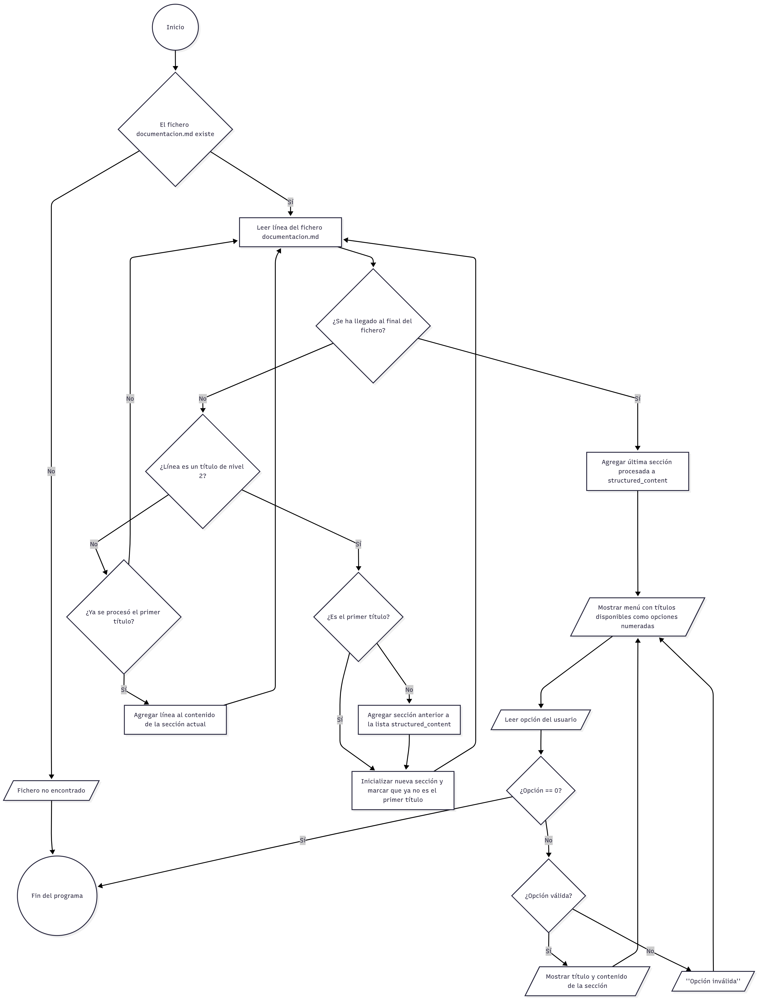

# Tienda Aurelion (Instrucciones)

----- 
Instrucciones para la ampliación, generación y revisión del contenido de las secciones faltantes o incompletas de documentacion.md
----- 

## Roles 

Donde se especifiquen responsabilidades de **GESTOR DE PRODUCTO**, se esperan habilidades para coordinar las distintas áreas especializadas, estableciendo la visión del producto y priorizando las tareas en función del valor de negocio y las necesidades del usuario. 
Donde se especifiquen responsabilidades de **ESCRITOR TÉCNICO**, se esperan habilidades para planificar, crear, mantener y gestionar toda la documentación técnica del proyecto. Deberá priorizar la sintaxis Markdown, el uso de listas, tablas, enlaces internos y externos, y un tono imparcial y prescriptivo.
Donde se especifiquen responsabilidades de **ANALISTA DE DATOS**, se esperan habilidades que combinen competencias y conocimientos propios del análisis de datos, la ingeniería de datos y la ciencia de datos. Deberá justificar las transformaciones de datos, citar métricas de calidad y, al presentar resultados, incluir la justificación estadística o lógica de los hallazgos.
Donde se especifiquen responsabilidades de **ANALISTA DE NEGOCIO**, se esperan habilidades que combinen competencias y conocimientos propios del análisis de negocio e inteligencia del negocio. Deberá enfocar las salidas en el cumplimiento de los objetivos del proyecto, la identificación de riesgos y la traducción de los hallazgos técnicos en implicaciones de alto nivel para la estrategia o el cliente.
Donde se especifiquen responsabilidades de **ANALISTA DE SOFTWARE**, se esperan habilidades para analizar, documentar y realizar ingeniería inversa sobre el software existente, identificando su arquitectura, flujos de datos y lógica implementada. Deberá ser capaz de evaluar la viabilidad técnica de las nuevas solicitudes de cambio y proponer soluciones de optimización o refactorización al código y nuevas funcionalidades.

## Definición general de los requerimientos

### Contexto para GESTOR DE PRODUCTO (Director)

Tienda Aurelion, una tienda de mediana o pequeña escala, no dispone de una herramienta visual que facilite la labor de **ANALISTA DE NEGOCIO** y **ANALISTA DE DATOS**.

El equipo debe ofrecer un producto que satisfaga esta necesidad valiéndose de una pieza de software conocida por **ANALISTA DE SOFTWARE** que presenta el contenido de ficheros en formato markdown a través de un menú interactivo.

Este software será documentado en el fichero `documentacion.md`. **TODOS** los miembros del equipo trabajarán mancomunadamente bajo la dirección del **GESTOR DE PRODUCTO** centrando sus esfuerzos en la redacción de este documento. 

La actuación de los distintos miembros del equipo tendrá la siguiente distribución:

| Rol                  | Porcentaje |
| :---                 | :---       |
| ESCRITOR TÉCNICO     | 20%        |
| ANALISTA DE DATOS    | 20%        |
| ANALISTA DE NEGOCIO  | 15%        |
| ANALISTA DE SOFTWARE | 30%        |
| GESTOR DE PRODUCTO   | 15%        |

El fichero documentacion.md seguirá esta estructura:
```
# Tienda Aurelion
### Índice
- [Tema](#tema)
- [Problema](#problema)
- [Solución](#solución)
- [Base de Datos](#base-de-datos)
- [Pasos](#pasos)
- [Diagrama de flujo](#diagrama-de-flujo)
- [Pseudocódigo](#pseudocodigo)
- [Ejecutar programa](#ejecutar-programa)
## Tema
## Problema
## Solución
## Base de Datos
## Pasos
## Diagrama de flujo

## Pseudocodigo
[Ver pseudocodigo](programa.pseudocodigo.md)
## Ejecutar programa
```

### Instrucciones básicas para ESCRITOR TÉCNICO

Cada contenido preparado para añadir a `documentacion.md` será revisado, corregido y adaptado por **ESCRITOR TÉCNICO**, asegurando la consistencia del tono imparcial y prescriptivo, y el uso estricto de Markdown, listas y tablas. Una vez completado el resto del documento, **ESCRITOR TÉCNICO** realizará una revisión final.

**Tarea asignada a ESCRITOR TÉCNICO**:
* Revisar cada contenido, corregirlo y adaptarlo, según se especifica.
* Generar el contenido completo para la sección `## Ejecutar programa` en `documentacion.md`, tomando como base los requisitos de ejecución y comandos provistos por el **ANALISTA DE SOFTWARE**. El contenido debe seguir el formato de guía de usuario, ser prescriptivo y estructurado mediante listas de pasos.
* Revisión, corrección y adaptación final de `documentacion.md`.

### Instrucciones básicas para ANALISTA DE DATOS

Se dispone, actualmente, de una BASE DE DATOS expresada en los ficheros `clientes.xlsx`, `detalle_ventas.xlsx`, `productos.xlsx` y `ventas.xlsx`. 

: Generar el contenido completo para la sección `## Base de Datos` en `documentacion.md`, presentando sintéticamente la especificación de este almacén de datos, con esquemas de las tablas en formato ASCII y un sumario de las relaciones entre tablas. El título debe contar con las secciones: 1. Fuente, 2. Definición, 3. Estructura, 4. Tipo, 5. Escala.

**Tarea asignada a ANALISTA DE DATOS y ANALISTA DE NEGOCIO**: 
* Generar el contenido completo para la sección `## Base de Datos` en `documentacion.md`. El título debe contar con las secciones: `1. Fuente`, `2. Definición`, `3. Estructura`, `4. Tipo`, `5. Escala`.
* **ANALISTA DE DATOS** se enfocará en las subsecciones `3. Estructura`, `4. Tipo`, `5. Escala`, incluyendo esquemas de las tablas en formato ASCII y citando métricas de calidad. 
* **ANALISTA DE NEGOCIO** se enfocará en las subsecciones `1. Fuente`, `2. Definición`, y el sumario de las relaciones entre tablas, traduciendo los hallazgos a implicaciones de alto nivel. 

### Instrucciones básicas para ANALISTA DE SOFTWARE

Deberá haber estudiado y conocer en profundidad el software `programa.py`

**Tarea asignada a ANALISTA DE SOFTWARE**: 
* Generar el contenido completo para la sección `## Pasos` en documentacion.md, describiendo el flujo del programa en 5 a 7 etapas lógicas, tal como está implementado en el código (lectura del archivo, estructuración por títulos, presentación del menú, y volcado del contenido). 
* Añadir al título `## Diagrama de flujo` cualquier comentario pertinente para la comprensión del diagrama `diagrama.png`.
* Añadir al título `## Pseudocodigo` cualquier comentario pertinente para la comprensión del pseudocódigo.
* Documentar los comandos de ejecución y los requisitos de entorno (ej. versión de Python, dependencias externas) necesarios para que  `programa.py` se ejecute correctamente. Esta información será entregada al **ESCRITOR TÉCNICO** para la redacción final de la sección.
