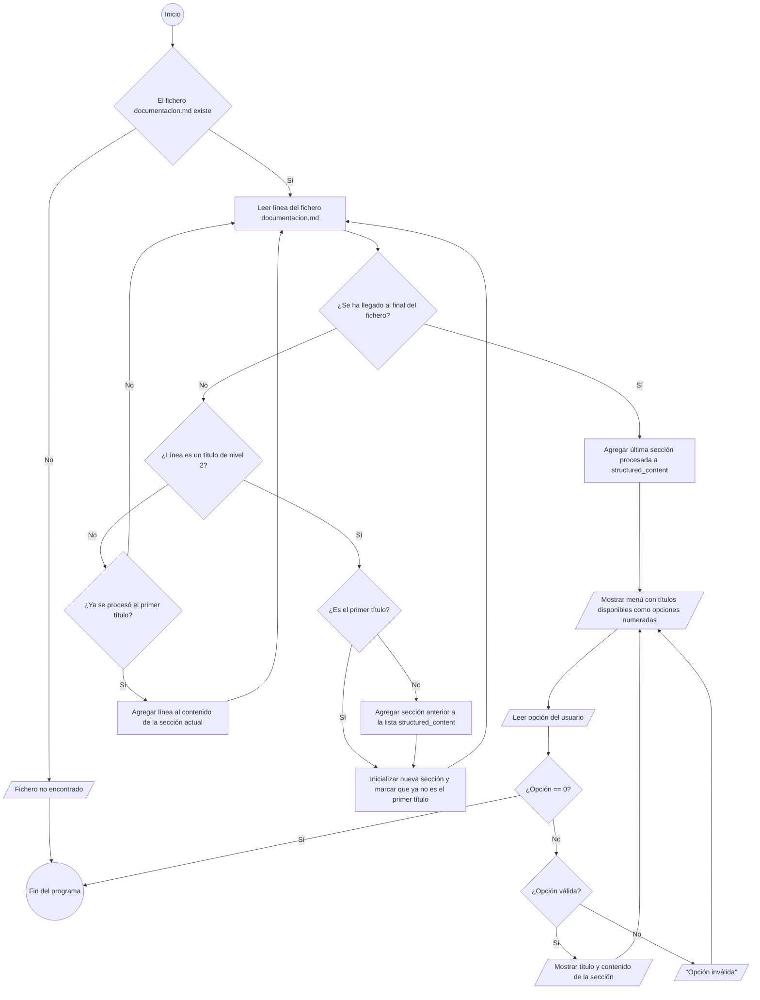

```mermaid
flowchart TD

%% --- INICIO Y BLOQUE DE LECTURA DE ARCHIVO ---
INI((Inicio)) --> EXISTEARCHIVO{El fichero documentacion.md existe}
EXISTEARCHIVO -->|No| SALIDA1[/"Fichero no encontrado"/]
SALIDA1 --> FIN((Fin del programa))
EXISTEARCHIVO -->|Sí| LECTURAARCHIVO[Leer línea del fichero documentacion.md]

LECTURAARCHIVO --> ULTIMALINEA{¿Se ha llegado al final del fichero?}
ULTIMALINEA -->|No| LINEAESTITULO{¿Línea es un título de nivel 2?}

LINEAESTITULO -->|Sí| PRIMERTITULO{¿Es el primer título?}
PRIMERTITULO -->|Sí| INITSECCION[Inicializar nueva sección y marcar que ya no es el primer título]
PRIMERTITULO -->|No| AGREGAANTERIOR[Agregar sección anterior a la lista structured_content]
AGREGAANTERIOR --> INITSECCION
INITSECCION --> LECTURAARCHIVO

LINEAESTITULO -->|No| CONTENIDOSECCION{¿Ya se procesó el primer título?}
CONTENIDOSECCION -->|Sí| ACUMULACONTENIDO[Agregar línea al contenido de la sección actual]
ACUMULACONTENIDO --> LECTURAARCHIVO
CONTENIDOSECCION -->|No| LECTURAARCHIVO

ULTIMALINEA -->|Sí| AGREGAFINAL[Agregar última sección procesada a structured_content]

AGREGAFINAL --> MOSTRARMENU[/Mostrar menú con títulos disponibles como opciones numeradas/]

%% --- BLOQUE DE MENÚ ---
MOSTRARMENU --> INPUTOPCION[/Leer opción del usuario/]
INPUTOPCION --> OPCIONCERO{¿Opción == 0?}
OPCIONCERO -->|Sí| FIN
OPCIONCERO -->|No| OPCIONVALIDA{¿Opción válida?}
OPCIONVALIDA -->|Sí| MOSTRARSECCION[/Mostrar título y contenido de la sección/]
MOSTRARSECCION --> MOSTRARMENU
OPCIONVALIDA -->|No| MSGINVALIDA[/''Opción inválida''/]
MSGINVALIDA --> MOSTRARMENU


```
